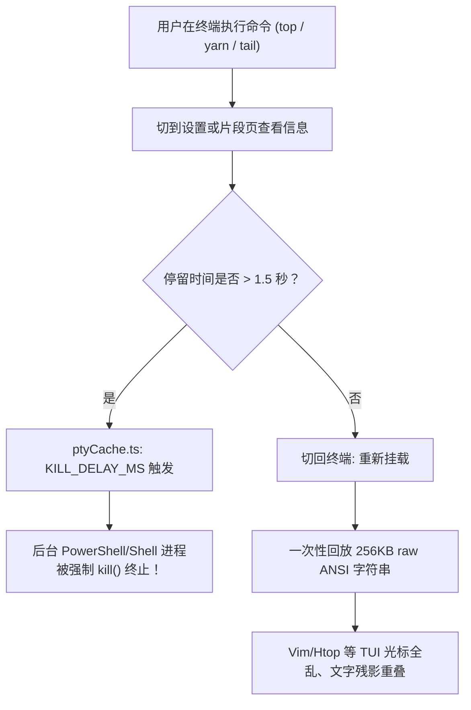

# TermX 项目架构与功能设计全景审计报告

> **报告版本**：v1.0  
> **生成时间**：2026-09-29  
> **审计对象**：TermX 桌面端（Tauri v2 + React 19 + russh + xterm 6）

---

## 1. 现状总览与核心定性

TermX 本身的愿景非常优秀——*“将终端、SFTP、端口转发、主机监控放在同一工作区，打造高效顺手的个人 SSH 客户端”*。然而，经过对代码库（前端 React 状态与组件树、Rust 原生后端、Pty/SSH 缓存层）的全面深度审计，目前的工程状态存在**严重的定位倒挂与功能割裂**。

其根本症结在于：**此前的开发过程完全以“对齐 16 个设计稿静态 Frame 截图”为导向，把本应是单窗口一体化的生产力工具，拆散成 16 个互斥的顶级路由页面，并充斥着大量无法运行的假功能、死锁逻辑与临时评审状态。**

### 维度评估

| 评估维度 | 当前等级 | 核心表现 |
| :--- | :---: | :--- |
| **应用架构与导航** | 🚨 **严重阻断** | 16 个独立路由导致终端频繁卸载；活动栏没有工作区入口，切走即迷失 |
| **会话与生命周期** | 🚨 **严重阻断** | 离开终端 1.5 秒即自杀销毁本地 shell；分屏共用 SSH 造成操作镜像互串且无法关闭 |
| **功能真实性与持久化**| ⚠️ **高度缺损** | 新建主机丢弃密码；快捷动作/片段只弹 Toast 不执行；欢迎页/端口转发/跳板机为纯静态假象 |
| **终端与网络底层** | ⚠️ **体验欠佳** | 缺少 WebGL 渲染引擎；跨包 UTF-8 字符撕裂乱码；全局快捷键侵入并拦截 tmux/bash 核心键 |
| **代码规范与整洁度** | ⚠️ **存在异味** | 硬编码个人开发路径（`suantian`）；各页面残留评审切换后门；批量探测同步阻塞主线程 |

---

## 2. 核心架构与导航模型缺陷

### 2.1 顶级路由倒挂：工作区成了“回不去的孤岛”
- **代码位置**：[`src/App.tsx#L40-L65`](file:///C:/Users/suantian/IdeaProjects/termx/src/App.tsx#L40-L65)、[`src/components/chrome/activities.ts#L13-L28`](file:///C:/Users/suantian/IdeaProjects/termx/src/components/chrome/activities.ts#L13-L28)
- **现象**：
  应用定义了 `/hosts`, `/workspace`, `/sftp`, `/forward`, `/snippets`, `/keys`, `/transfers`, `/monitor`, `/settings` 等 16 个独立全屏路由。
  左侧 ActivityBar 仅包含：`主机库`、`文件`、`转发`、`片段`、`密钥`、`传输`、`设置`。**完全没有「终端 / 工作区」的导航入口**。
- **后果**：
  用户在 Workspace 中开着终端运行任务，一旦点击左侧任何图标（例如查看设置），整个 Workspace 连同 DOM 树立刻被完全卸载。用户在导航栏上再也找不到回到终端的按钮；除非重新进主机库找到该主机并点击，若开的是本地终端，则直接陷入死胡同。

### 2.2 侧边栏模式崩塌：整页跳出取代了抽屉/面板
- **设计原型对比**：
  需求书中描述的主窗口模型是 **“常驻多标签终端 + 可切换侧边栏/底部抽屉”**（类似 VS Code、OxideTerm）。
- **实际实现**：
  点击左侧活动栏不是在左侧弹出对应抽屉，而是把主屏幕内容整个替换，把终端直接排挤出视口。

### 2.3 繁琐割裂的全屏 Connect 流程
- **代码位置**：[`src/screens/Connect.tsx`](file:///C:/Users/suantian/IdeaProjects/termx/src/screens/Connect.tsx)（长达 1717 行）
- **现象**：
  点击连接任意一台主机，界面都会强行跳出当前工作台，全屏进入 `/connect?host=...`，展示 5 步进度条。即便密码早已配置，也必须在该全屏页面等待握手完成后再跳回工作区。无法在工作区内并发开启多个连接。

---

## 3. 会话与终端生命周期的硬伤



### 3.1 离开 1.5 秒即杀本地 Shell（PTY 自杀计时器）
- **代码位置**：[`src/components/terminal/ptyCache.ts#L18-L117`](file:///C:/Users/suantian/IdeaProjects/termx/src/components/terminal/ptyCache.ts#L18-L117)
- **原因**：设置了 `KILL_DELAY_MS = 1500`。原本目的是处理 React 18/19 StrictMode 卸载，但因路由跳转卸载了组件，只要用户看别的界面超过 1.5 秒，本地任务直接被强杀。

### 3.2 分屏（Split Pane）是“连体婴儿”，且无法关闭
- **代码位置**：[`src/screens/Workspace.tsx#L881-L897`](file:///C:/Users/suantian/IdeaProjects/termx/src/screens/Workspace.tsx#L881-L897)
- **现象**：
  在 `panesForTab` 中，水平 2 分屏或 4 分屏时，新生成的格子强制被赋予 `sessionKey: tab.sessionKey`。
- **后果**：
  1. **输入与输出互串**：分屏 1 和分屏 2 挂载在同一个 SSH 通道上。在屏 1 键入内容，屏 2 同步接收回显；
  2. **Resize 互毁**：屏 1 改变大小上报 PTY 尺寸，会瞬间打乱屏 2 正在运行程序的行列排版；
  3. **无法关闭**：界面中没有关闭单个分屏的任何 UI 交互，`splitRight` 只能单向增加（1 -> 2 -> 4），一旦分屏就再也退不回单屏。

### 3.3 256KB Raw ANSI 文本重放副作用与性能损耗
- **代码位置**：[`src/components/terminal/sshCache.ts#L62-L178`](file:///C:/Users/suantian/IdeaProjects/termx/src/components/terminal/sshCache.ts#L62-L178)
- **现象**：
  每次接收数据包都执行 `(replay + chunk).slice(-MAX_BUFFER)`，带来极高的 GC 负担。
  组件重新挂载时，直接将 256KB 控制字符重新写入 xterm。由于全屏交互程序（Vim、tmux、htop）依赖 Alternate Screen Buffer 与特定的游标指令，直接重放历史流会导致严重的屏幕错位与乱码。

---

## 4. “伪真实”交互与功能断层

### 4.1 新建主机丢弃密码
- **代码位置**：[`src/screens/HostEdit.tsx#L162-L185`](file:///C:/Users/suantian/IdeaProjects/termx/src/screens/HostEdit.tsx#L162-L185)
- **问题**：用户在表单填入密码并勾选“记住密码”，保存时构建的 `record` 根本不包含该密码，也未调用 `secretSave` 保存到系统钥匙串，密码被无视并直接丢弃。保存后首次连接仍要求再次手动输入。

### 4.2 命令面板与片段“假响应”
- **代码位置**：
  - [`src/components/chrome/CommandPalette.tsx#L168-L175`](file:///C:/Users/suantian/IdeaProjects/termx/src/components/chrome/CommandPalette.tsx#L168-L175)
  - [`src/screens/Snippets.tsx#L238-L246`](file:///C:/Users/suantian/IdeaProjects/termx/src/screens/Snippets.tsx#L238-L246)
- **问题**：
  - 在 `Ctrl+K` 中执行“新建标签”、“向右分屏”、“向下分屏”、“广播输入”等命令，代码仅执行了 `toast({ title: "已执行..." })`，没有任何业务逻辑响应。
  - 在命令片段中点击“发送”，实际上仅调用了剪贴板复制，并弹出 Toast 提示“*命令已复制，终端注入尚未接入... 请先手动粘贴执行*”。

### 4.3 欢迎引导与锁屏死锁
- **代码位置**：
  - [`src/screens/Welcome.tsx#L21-L27`](file:///C:/Users/suantian/IdeaProjects/termx/src/screens/Welcome.tsx#L21-L27)
  - [`src/components/chrome/LockGate.tsx#L112-L155`](file:///C:/Users/suantian/IdeaProjects/termx/src/components/chrome/LockGate.tsx#L112-L155)
- **问题**：
  - 欢迎页中的导入源数量（OpenSSH 12项、Xshell 8项等）全部是静态常数，点击下一步既不解析也不导入。第二步填写的测试主机与第三步的主密码在点击完成后直接丢弃。
  - 锁屏遮罩覆盖 `z-[100]`，底部注明“*忘了密码只能在设置页重设*”。但由于遮罩阻断了全部交互，用户根本无法进入设置页，一旦遗忘主密码将被永久锁死在应用外。

### 4.4 端口转发为纯状态标记
- **代码位置**：[`src/screens/Forward.tsx#L143-L147`](file:///C:/Users/suantian/IdeaProjects/termx/src/screens/Forward.tsx#L143-L147)
- **问题**：点击规则启动，只是将前端 store 里的状态字段置为 `running` 并提示“*当前版本只保存规则状态*”，后端零网络转发实现。

---

## 5. 底层网络、终端引擎与细节缺陷

### 5.1 跳板机与代理在后端代码中为 0 行实现
- **代码位置**：[`src-tauri/src/ssh.rs#L441`](file:///C:/Users/suantian/IdeaProjects/termx/src-tauri/src/ssh.rs#L441)
- **问题**：`HostEdit` 中设计完备的跳板机链与 Socks5/HTTP 代理，在后端 `ssh_connect` 中完全没有接收参数，Rust 后端全局搜索 `jump`、`proxy`、`bastion` 结果为零。

### 5.2 跨分包 UTF-8 边界字符撕裂
- **代码位置**：[`src-tauri/src/pty.rs#L100`](file:///C:/Users/suantian/IdeaProjects/termx/src-tauri/src/pty.rs#L100)、[`src-tauri/src/ssh.rs#L398`](file:///C:/Users/suantian/IdeaProjects/termx/src-tauri/src/ssh.rs#L398)
- **问题**：每次读取套接字直接 `String::from_utf8_lossy(&buf[..n])`。当 3 字节的中文字符或 4 字节 Emoji 恰好被分包边界切断时，首段直接被篡改为 `\uFFFD`（），导致中文字符偶发性乱码。

### 5.3 全局快捷键暴力抢占系统与终端键位
- **代码位置**：[`src/components/chrome/WindowChrome.tsx#L37-L65`](file:///C:/Users/suantian/IdeaProjects/termx/src/components/chrome/WindowChrome.tsx#L37-L65)
- **冲突列表**：
  - `Ctrl + B`：被截获用于“折叠侧栏”，直接废掉了 Linux/macOS 运维中最核心的 **tmux 默认前缀键**；
  - `Ctrl + K`：被截获用于打开命令面板，打断了 bash/zsh 中光标剪切至行尾的标准操作；
  - 缺乏 `attachCustomKeyEventHandler`：终端中选区复制（`Ctrl+C`）与中断信号（SIGINT `\x03`）未做区分处理。

### 5.4 终端缺少 WebGL 渲染加速与成熟搜索插件
- 依赖 DOM 渲染器，在大量文本滚屏时易卡顿掉帧；
- 在 [`Terminal.tsx#L399`](file:///C:/Users/suantian/IdeaProjects/termx/src/components/terminal/Terminal.tsx#L399) 中手写遍历 active buffer 的粗糙搜索算法，并暴力调用 `term.select`，破坏了正常的鼠标文本选择。

### 5.5 硬编码个人路径与用户名
- **代码位置**：[`src/components/terminal/Terminal.tsx#L392`](file:///C:/Users/suantian/IdeaProjects/termx/src/components/terminal/Terminal.tsx#L392)、[`demoContent.ts#L53`](file:///C:/Users/suantian/IdeaProjects/termx/src/components/terminal/demoContent.ts#L53)
  ```ts
  if (!hostId) return title.startsWith("PS ") ? title : "PS C:\\Users\\suantian>";
  ```
  硬编码了开发者本地用户路径 `suantian`。

---

## 6. 系统目标架构重构设计

针对上述问题，TermX 需要从“多页面路由跳转模式”转型为**“现代一体化单窗口多标签工作台架构”**。

### 6.1 目标主窗口布局架构图

```
┌─────────────────────────────────────────────────────────────────────────────┐
│ WindowChrome (自定义标题栏、平台窗口控制、居中命令面板、全局状态栏)           │
├────┬──────────────┬─────────────────────────────────────────────────────────┤
│ 活 │ 侧边抽屉面板  │ 终端主工作台 (Workspace - 核心常驻组件，永不卸载)        │
│ 动 │ (可折叠 240px)├─────────────────────────────────────────────────────────┤
│ 栏 │              │ 标签栏: [SSH: prod-api-01] [本地终端 1] [+] [分屏] [SFTP] │
│    │ • 主机树库   ├────────────────────────────┬────────────────────────────┤
│ 🖧 │ • 远程文件树  │ 终端分屏 1                 │ 终端分屏 2 (独立会话)      │
│ 📁 │ • 命令片段库  │ (Active SSH Session A)     │ (Independent Session B)    │
│ ⚡ │ • 端口转发库  │                            │                            │
│ 🔑 │ • 密钥管理器  ├────────────────────────────┴────────────────────────────┤
│    │              │ 可收起底部抽屉 (嵌入式 SFTP / 传输队列 / 快速日志)         │
│ ⚙  │ • 设置(抽屉)  │ (跟随当前活动终端的工作目录切换)                            │
└────┴──────────────┴─────────────────────────────────────────────────────────┘
```

### 6.2 架构核心改造原则

1. **终端常驻，页面变为面板**：
   - 移除 `/sftp`、`/snippets`、`/keys`、`/forward` 等独立路由，将其改造为**左侧侧边栏中的视图组件**（或者通过 Modal / Drawer 浮层展示）；
   - 用户在操作主机库、查看配置、编辑密钥时，右侧的终端会话、分屏和连接状态完全不受干扰。
2. **标签内就地连接（In-Tab Connection）**：
   - 彻底废除全屏跳出的 `/connect` 页面；
   - 点击主机库中的主机，立即在 Workspace 标签栏新增一个 Tab，Tab 内部显示连接中动画、指纹确认或密码输入框，连接成功就地切换为终端。
3. **分屏独立会话与可关闭管理**：
   - 每个分屏格分配独立的 `sessionKey`，分屏时默认开启新的 Shell 通道或本地 PTY；
   - 每个分屏格右上角增加“关闭分屏”按钮，关闭后自动平铺剩余网格；
   - 单屏、2 分屏、上下分屏、4 分屏之间支持双向平滑切换。
4. **会话管理器后台守护（Session Manager Daemon）**：
   - PTY 和 SSH 会话生命周期由全局单一实体管控，禁止任何组件卸载时的短时超时强杀；
   - 切出终端时通过 CSS 隐藏组件而非销毁 DOM，彻底告别 raw ANSI 字符串重放。
5. **快捷键委托机制**：
   - 为 xterm 接入 `attachCustomKeyEventHandler`；
   - 凡焦点在终端内部时，放行 `Ctrl+B`、`Ctrl+K`、`Ctrl+C`、`Ctrl+W` 等关键键位给终端，全局快捷键改用 `Ctrl+Shift+P / Ctrl+Shift+K` 或仅在非终端焦点时响应。

---

## 7. 实施路线图与优先级清单

### Phase 1：架构与生命周期止血（P0）
- [ ] **重构主窗口布局**：将活动栏改造为侧边面板切换器，让终端工作区作为全时常驻主视窗。
- [ ] **移除 1.5 秒杀进程逻辑**：清理 `ptyCache.ts` 中的 `KILL_DELAY_MS`，将会话存续与前端 UI 挂载解耦。
- [ ] **修复分屏独立通道与关闭功能**：分屏创建独立通道，补充关闭分屏逻辑。
- [ ] **改造连接流程为就地 Tab 连接**：移除全屏 `/connect` 路由，密码、指纹确认就地嵌入新 Tab。
- [ ] **接入真实凭据保存**：在 `HostEdit` 保存时将密码写入系统 Keyring。
- [ ] **彻底清理评审状态机**：移除各页面中的 `ReviewSwitcher`，删除写死的 `suantian` 路径。

### Phase 2：终端专业化与功能打通（P1）
- [ ] **接入官方 Addon**：引入 `@xterm/addon-webgl` 提升吞吐；引入 `@xterm/addon-search` 提供高质量搜索。
- [ ] **优化快捷键通道**：解决 `Ctrl+B`（tmux）、`Ctrl+K`（bash）与全局热键的冲突。
- [ ] **打通命令面板与片段注入**：真正向当前焦点终端写入命令字符串与换行符。
- [ ] **解决 UTF-8 跨包字符撕裂**：优化 Rust 到前端的字节流传递机制。

### Phase 3：高级网络与子系统真实化（P2）
- [ ] **真正实现端口转发**：基于 `russh::client::Channel::open_direct_tcpip` 实现本地/动态端口转发通道。
- [ ] **接入 SFTP 子系统**：基于 `russh-sftp` 实现远程目录读取与文件上传下载。
- [ ] **补齐跳板机与网络代理链**：在 Rust 侧支持 ProxyJump 链式认证与 Socks5 代理建连。
- [ ] **真实欢迎引导迁移**：读取真实的 `~/.ssh/config` 并提供导入功能。
